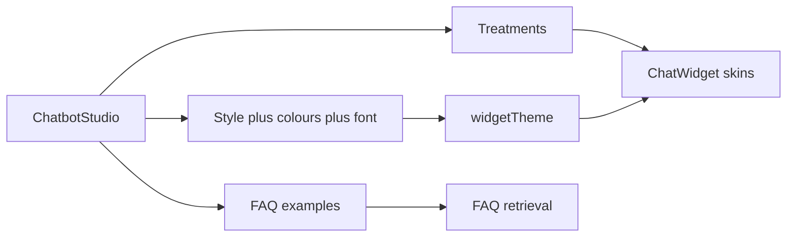

# Dense chatbot editor with style skins

## Current state

[`src/app/app/chatbots/[id]/page.tsx`](src/app/app/chatbots/[id]/page.tsx) is one tall stack of cards (identity, 3 colours, avatar, booking, greetings, embed iframe, treatments, FAQs). The live widget in [`src/app/w/[widgetKey]/chat-widget.tsx`](src/app/w/[widgetKey]/chat-widget.tsx) has a **single** layout. Theme is only `accentColor`, `panelColor`, `buttonTextColor` via [`widgetTheme`](src/lib/widget.ts). Knowledge is add/delete with no example library.

Existing bots keep working: new fields default to the current look (`orbital` + Geist-equivalent + current colours).

## Architecture

One behaviour layer (home → lead / book / call → chat) and several **skins**. Treatments (`lead` | `book` | `call`) stay the same data; each skin only changes how those buttons, bubbles, launcher, and composer look.

## 1. Persist appearance on `Chatbot`

In [`src/lib/types.ts`](src/lib/types.ts) and [`widgetFieldDefaults`](src/lib/types.ts) / [`saveChatbotAction`](src/lib/actions.ts):

- `widgetStyle`: one of `orbital` | `glass` | `sheet` | `messenger` | `dock` | `pulse` (default `orbital` = today’s pill header + FAB + 2-col grid)
- `fontFamily`: curated id (`instrument`, `manrope`, `jakarta`, `outfit`, `sora`, `dmSans`, `system`)
- Extra colour tokens so every skin can be re-coloured without CSS hacks: `surfaceColor` (panel chrome), `userBubbleColor`, `assistantBubbleColor`, `launcherColor` (fallback to accent)

`widgetTheme()` returns style + font + all colours. Preview iframe in [`src/app/w/[widgetKey]/page.tsx`](src/app/w/[widgetKey]/page.tsx) passes them into `ChatWidget`.

## 2. Six modern skins, same functions

Refactor [`chat-widget.tsx`](src/app/w/[widgetKey]/chat-widget.tsx) into:

- Shared hook/state: open/close, intro sequence, `onAction`, lead POST, chat POST
- Skin components that only render chrome

| Id | Look | How treatments render |
|---|---|---|
| `orbital` | Current: FAB, pill header, sequential bubbles | 2-col cards |
| `glass` | Frosted panel, soft blur, thin launcher | Chip grid |
| `sheet` | iOS-style bottom sheet, grab handle | Full-width stacked rows |
| `messenger` | Full-height thread, compact composer | Suggestion pills under greetings |
| `dock` | Narrow docked column, avatar rail | Icon+label list |
| `pulse` | Gradient ring launcher, high-contrast bubbles | Rounded tiles |

Fonts load only in the widget iframe ([`src/app/w/[widgetKey]/layout.tsx`](src/app/w/[widgetKey]/layout.tsx)) via `next/font/google` (or a small font map) and apply with `style.fontFamily` on `[data-widget-root]`. Colours always come from tokens so swapping a skin does not lock branding.

Add matching CSS in [`src/app/globals.css`](src/app/globals.css) (skin classes, not a second animation system).

## 3. Compressed studio page

Replace the stacked editor with a **two-column studio** (sticky preview on `lg+`):

**Left (dense controls, small type, tight grids):**

- Header: name inline, active switch, one primary Save
- **Look** — 6 style cards (mini CSS thumbnails, selected ring). Clicking a style sets `widgetStyle` and optional suggested palettes; all colour/font fields stay editable so any skin + any palette + any font combines
- **Colour & type** — compact colour grid (accent, panel, button text, surface, user/assistant bubbles, launcher) + font select with live sample
- **Identity** — avatar crop, avatar name, system prompt in a short textarea
- **Voice** — greetings (one line = one bubble)
- **Connect** — phone + booking URL
- **Actions** — existing treatment CRUD, more compact rows; hint that every style uses the same buttons
- **Knowledge** — see below
- **Embed** — snippet, widget key

**Right:** existing preview iframe (`/w/{key}?preview=1`), taller, always visible while scrolling.

Keep POST-to-`/api/form/*` so auth and store stay the same. Appearance can live in a small client island (`ChatbotAppearanceFields`) for style/font/colour pickers with hex + native colour inputs.

Optional live preview without a full rewrite: in preview mode, pass unsaved tokens as query (`?preview=1&style=&font=&accent=…`) and have the widget page prefer those over stored theme. If that gets noisy, save-then-refresh the iframe is acceptable; prefer query override if it stays short.

## 4. Knowledge examples

Add [`src/lib/knowledge-examples.ts`](src/lib/knowledge-examples.ts): a catalog of dental FAQ **examples the user can choose**, grouped (practice, patients, treatments, money, visits). Each item is `{ title, question, answer }` matching `KnowledgeItem`.

Examples to include (editable after add): opening hours, new NHS/private patients, emergencies, parking, children, cancellation, Invisalign, whitening, implants, hygiene, facial aesthetics, fees, finance, aftercare, what to bring.

UI on the editor:

- Category chips + compact example cards (“Add”) posting to existing `addKnowledge`
- “Add group” posts several FAQs (new action `addKnowledgePack` or repeated hidden fields)
- Existing FAQs stay as a tight list with Remove
- Skip duplicates by title+question if already on the bot

## 5. Files to touch

- [`src/lib/types.ts`](src/lib/types.ts), [`src/lib/widget.ts`](src/lib/widget.ts), [`src/lib/actions.ts`](src/lib/actions.ts), [`src/app/api/form/[name]/route.ts`](src/app/api/form/[name]/route.ts)
- [`src/app/app/chatbots/[id]/page.tsx`](src/app/app/chatbots/[id]/page.tsx) + new components under `src/components/chatbot-studio/`
- [`src/app/w/[widgetKey]/chat-widget.tsx`](src/app/w/[widgetKey]/chat-widget.tsx), `page.tsx`, `layout.tsx`
- [`src/app/globals.css`](src/app/globals.css)
- [`src/lib/knowledge-examples.ts`](src/lib/knowledge-examples.ts)

Before coding, skim `node_modules/next/dist/docs/` for App Router / `next/font` as required by this repo’s Next version.

## 6. Verify in the browser

On `/app/chatbots/{id}`: switch all 6 styles, change font and several colours, confirm preview + embed widget still run greetings, treatment grid/chips, book/call/lead, chat. Add 2–3 knowledge examples and confirm they appear in the list. Check a second route that only lists bots (`/app/chatbots`) still links correctly. Desktop density and a narrower viewport for the control column.