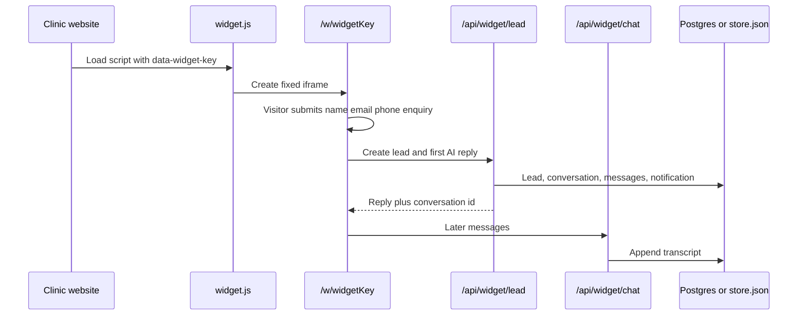

# How LeadDoc is put together

LeadDoc is a SaaS product for dental practices. A clinic embeds a branded AI chat on its website. Visitors leave their details, the chat becomes a lead in the clinic CRM, and the platform bills the practice monthly. A platform admin can see and manage every clinic.

This file explains the moving parts that sit behind every page. Page-by-page behaviour lives in [pages/](pages/). HTTP endpoints live in [apis.md](apis.md).

## Stack

- **Next.js App Router** (see the warning in [AGENTS.md](../AGENTS.md) — this is not “classic” Next.js).
- **React** for the UI.
- **Tailwind CSS** for styling.
- **Postgres** (Supabase) when `DATABASE_URL` is set. Local demo can keep `USE_JSON_STORE=1` and use `.data/store.json`. Production on Vercel must use Postgres. The schema is [`supabase/schema.sql`](../supabase/schema.sql).

There is no Next.js middleware. Each layout or page checks who is allowed in.

## Three kinds of user

### Public visitor (no login)

Someone on a clinic website. They see the chat widget (`/w/[widgetKey]`) loaded by `/widget.js`. They are identified only by the widget key (`dc_...`). They must give name, email, phone, and an enquiry before they can chat.

The widget only works if the clinic’s subscription is `active` or `trialing`, or a platform admin has turned on “allow widget without subscription”. The clinic app itself is not gated — unpaid clinics can still log in and finish setup.

### Clinic staff (`/app`)

A logged-in person who belongs to one practice. Roles:

- **clinic_owner** — full access to that practice, including inviting staff.
- **clinic_staff** — same CRM and chatbot tools; cannot invite staff (`canManageClinic` in `src/lib/auth.ts`).

All clinic data is filtered by `organizationId`. The layout at `src/app/app/layout.tsx` calls `getClinicContext()` and sends anyone who is not signed in to `/login`.

### Platform admin (`/admin`)

A user with role **super_admin**. They are not tied to one clinic. They can list every practice, edit billing and plans, add support notes, and **impersonate** a clinic (work in `/app` as if they were that practice). Non-admins who hit `/admin` are sent to `/app`.

On a live database the first admin is created from `ADMIN_EMAIL` and `ADMIN_PASSWORD`. Local JSON demo still seeds `clinic@dentchat.local` and `admin@dentchat.local`.

## Sign-in and cookies

Sessions are cookie-based, not JWT. The cookie value is a signed profile id (HMAC with `SESSION_SECRET`), HttpOnly, 30 days, `SameSite=Lax`, and `Secure` on HTTPS.

| Cookie | Purpose |
| --- | --- |
| `dentchat_session` | The signed-in user’s profile id. |
| `dentchat_impersonate_org` | When a super admin is “acting as” a clinic, this holds that organisation id (also signed). |

Login is `POST /api/auth/login`. Super admins land on `/admin`; everyone else lands on `/app`. Logout is `POST /api/form/logout`. Password reset is `/forgot-password` then `/reset-password`.

The cookie prefix `dentchat_` is a leftover name. The product name is **LeadDoc**.

Login, signup, password reset, widget chat, and website scan are rate-limited per IP.

## Data

[`src/lib/store.ts`](../src/lib/store.ts) is the facade. With `USE_JSON_STORE=1` it reads `.data/store.json`. Otherwise it uses Postgres (`src/lib/store-pg.ts`) with an advisory lock around writes so Vercel instances do not clobber each other.

First JSON run seeds a demo clinic (“Bright Smile Dental”). Postgres never seeds that clinic. It inserts the monthly plan (and `STRIPE_PRICE_ID` if set) and the admin from env.

Main records (types in [`src/lib/types.ts`](../src/lib/types.ts)):

- **organizations** — a practice: branding, phone, booking URL, Stripe ids, subscription status.
- **profiles** — people who can log in (password hash on the row; not Supabase Auth).
- **chatbots** — one embeddable widget per bot: greetings, widget key, skin, font, colour tokens, avatar, phone, booking URL, plus setup state. New signups start as inactive drafts until Go live.
- **chatbotOptions** — treatment buttons on the widget (lead / book / call).
- **knowledgeItems** — FAQ snippets the AI can use.
- **leads** — captured visitors, with status, assignee, pipeline stage, value.
- **pipelines** and **pipeline stages** — treatment journeys.
- **conversations** and **messages** — the chat transcript.
- **leadTasks**, **leadNotes**, **leadRecalls**, **leadEvents** — CRM extras on a lead.
- **notifications** — in-app “new lead” alerts for the clinic.
- **plans** — the monthly subscription product.
- **supportNotes** — internal admin notes on a clinic.
- **passwordResetTokens** — hashed reset links, one hour.

Server mutations live in [`src/lib/actions.ts`](../src/lib/actions.ts). Browser forms usually `POST` to `/api/form/[name]`, which looks up a named handler and runs the matching action.

## Billing

Clinics subscribe monthly. Statuses: `inactive`, `trialing`, `active`, `past_due`, `canceled`.

- Clinic **Settings** starts checkout (`POST /api/form/checkout`) and, after a customer exists, **Manage billing** opens the Stripe Customer Portal.
- Stripe sends events to `POST /api/stripe/webhook`, which verifies `STRIPE_WEBHOOK_SECRET` and updates the organisation. `past_due` emails the clinic owner.
- Admins can link a Stripe customer, create a subscription, charge a card on file, or allow the widget to run without a paid sub.
- Simulation (activate without Stripe) only happens with `USE_JSON_STORE=1`. Production fails closed if keys are missing.

The widget is gated on subscription unless `allowWidgetWithoutSub` is true.

## Widget embed flow

1. The clinic runs **Set up with AI** after signup (or opens an existing bot in the studio) and copies a snippet. It loads `/widget.js` with `data-widget-key`.
2. The script injects a transparent iframe pointing at `/w/{key}`. Closed, it is a small launcher in the corner; open, it is a tall panel. The iframe tells the parent to resize via `postMessage` (`source: "dentchat"`).
3. The visitor must submit contact details first. That creates a lead, a conversation, an in-app notification, and (if Resend is configured) an email to the clinic owner.
4. Further messages go to `/api/widget/chat`. Replies use Gemini. Without a key, production errors; local JSON demo may use a FAQ keyword fallback.

Studio live preview loads the same page with `?preview=1` and can overlay colours/fonts from query params without saving.

## AI replies

[`src/lib/gemini.ts`](../src/lib/gemini.ts) calls the Gemini API (`gemini-3.6-flash` unless `GEMINI_MODEL` is set) for clinic widget replies, website extract during setup, and the setup interview. The key is read from `GEMINI_API_KEY`. Scan, setup chat, and widget routes allow up to 60 seconds on Vercel.

## File uploads

Chatbot avatar photos are JPEG only, max 1.5 MB. On Vercel they go to a public Supabase Storage bucket named `avatars`. Local JSON demo can still write `.data/uploads/` and serve `/api/uploads/[filename]`. Upload requires a signed-in user with an active clinic (including impersonation).

## Where the code lives

| Concern | Typical files |
| --- | --- |
| Pages | `src/app/**/page.tsx` |
| HTTP APIs | `src/app/api/**/route.ts`, `src/app/widget.js/route.ts` |
| Form handlers | `src/app/api/form/[name]/route.ts` → `src/lib/actions.ts` |
| Auth | `src/lib/auth.ts` |
| Persistence | `src/lib/store.ts`, `src/lib/store-pg.ts`, `src/lib/store-json.ts` |
| Widget look and access | `src/lib/widget.ts`, `src/lib/widget-appearance.ts` |
| Chatbot setup wizard | `src/lib/site-scan.ts`, `src/lib/setup-interview.ts`, `src/lib/chatbot-setup.ts`, `src/components/chatbot-setup/` |
| Gemini (widget + setup) | `src/lib/gemini.ts` |
| Clinic CRM helpers | `src/lib/leads.ts`, `src/lib/pipelines.ts` |
| Shared UI chrome | `src/components/dashboard-shell.tsx`, `src/components/ui.tsx` |
