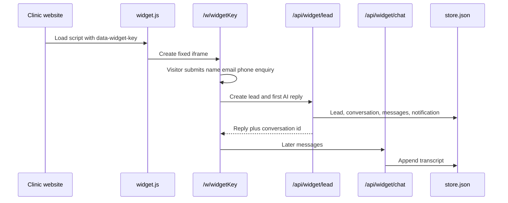

# How LeadDoc is put together

LeadDoc is a SaaS product for dental practices. A clinic embeds a branded AI chat on its website. Visitors leave their details, the chat becomes a lead in the clinic CRM, and the platform bills the practice monthly. A platform admin can see and manage every clinic.

This file explains the moving parts that sit behind every page. Page-by-page behaviour lives in [pages/](pages/). HTTP endpoints live in [apis.md](apis.md).

## Stack

- **Next.js App Router** (see the warning in [AGENTS.md](../AGENTS.md) — this is not “classic” Next.js).
- **React** for the UI.
- **Tailwind CSS** for styling.
- **Local JSON store** at `.data/store.json` for all app data in the running demo. Production is intended to move to Supabase; the schema is in [`supabase/schema.sql`](../supabase/schema.sql) but is not wired up yet.

There is no Next.js middleware. Each layout or page checks who is allowed in.

## Three kinds of user

### Public visitor (no login)

Someone on a clinic website. They see the chat widget (`/w/[widgetKey]`) loaded by `/widget.js`. They are identified only by the widget key (`dc_...` or the demo key). They must give name, email, phone, and an enquiry before they can chat.

The widget only works if the clinic’s subscription is `active` or `trialing`, or a platform admin has turned on “allow widget without subscription”.

### Clinic staff (`/app`)

A logged-in person who belongs to one practice. Roles:

- **clinic_owner** — full access to that practice, including inviting staff.
- **clinic_staff** — same CRM and chatbot tools; cannot invite staff (`canManageClinic` in `src/lib/auth.ts`).

All clinic data is filtered by `organizationId`. The layout at `src/app/app/layout.tsx` calls `getClinicContext()` and sends anyone who is not signed in to `/login`.

### Platform admin (`/admin`)

A user with role **super_admin**. They are not tied to one clinic. They can list every practice, edit billing and plans, add support notes, and **impersonate** a clinic (work in `/app` as if they were that practice). Non-admins who hit `/admin` are sent to `/app`.

Demo logins (password `password` for both): `clinic@dentchat.local` and `admin@dentchat.local`.

## Sign-in and cookies

Sessions are cookie-based, not JWT.

| Cookie | Purpose |
| --- | --- |
| `dentchat_session` | The signed-in user’s profile id. HttpOnly, 30 days. |
| `dentchat_impersonate_org` | When a super admin is “acting as” a clinic, this holds that organisation id. |

Login is `POST /api/auth/login`. Super admins land on `/admin`; everyone else lands on `/app`. Logout is `POST /api/form/logout`.

The cookie prefix `dentchat_` and demo emails (`@dentchat.local`) are leftover names. The product name is **LeadDoc**.

## Data: the JSON store

[`src/lib/store.ts`](../src/lib/store.ts) reads and writes `.data/store.json`. Mutations go through a queue so two writes cannot clobber each other. First run seeds a demo clinic (“Bright Smile Dental”), demo leads, pipelines, and a widget key.

Main records (types in [`src/lib/types.ts`](../src/lib/types.ts)):

- **organizations** — a practice: branding, phone, booking URL, Stripe ids, subscription status.
- **profiles** — people who can log in.
- **chatbots** — one embeddable widget per bot: greetings, widget key, skin, font, colour tokens (accent, panel, ink, surface, bubbles, launcher), avatar, phone, booking URL.
- **chatbotOptions** — treatment buttons on the widget (lead / book / call).
- **knowledgeItems** — FAQ snippets the AI can use. Clinics edit example text, add it, then edit or remove it later.
- **leads** — captured visitors, with status, assignee, pipeline stage, value.
- **pipelines** and **pipeline stages** — treatment journeys (e.g. Invisalign: New enquiry → Consult booked).
- **conversations** and **messages** — the chat transcript.
- **leadTasks**, **leadNotes**, **leadRecalls**, **leadEvents** — CRM extras on a lead.
- **notifications** — in-app “new lead” alerts for the clinic.
- **plans** — the monthly subscription product.
- **supportNotes** — internal admin notes on a clinic.

Server mutations live in [`src/lib/actions.ts`](../src/lib/actions.ts). Browser forms usually `POST` to `/api/form/[name]`, which looks up a named handler and runs the matching action.

## Billing

Clinics subscribe monthly. Statuses: `inactive`, `trialing`, `active`, `past_due`, `canceled`.

- Clinic **Settings** starts checkout (`POST /api/form/checkout`).
- Stripe sends events to `POST /api/stripe/webhook`, which updates the organisation’s customer id, subscription id, and status.
- Admins can link a Stripe customer, create a subscription, charge a card on file, or allow the widget to run without a paid sub.
- If Stripe keys are missing, subscribe and admin charge **simulate locally** so the demo still works.

The widget is gated on subscription unless `allowWidgetWithoutSub` is true.

## Widget embed flow

1. The clinic copies a snippet from the chatbot studio. It loads `/widget.js` with `data-widget-key`.
2. The script injects a transparent iframe pointing at `/w/{key}`. Closed, it is a small launcher in the corner; open, it is a tall panel. The iframe tells the parent to resize via `postMessage` (`source: "dentchat"`).
3. The visitor must submit contact details first. That creates a lead, a conversation, an in-app notification, and (if Resend is configured) an email to the clinic owner.
4. Further messages go to `/api/widget/chat`. Replies use OpenAI when `OPENAI_API_KEY` is set; otherwise a FAQ keyword fallback.

Studio live preview loads the same page with `?preview=1` and can overlay colours/fonts from query params without saving.

## AI replies

[`src/lib/openai.ts`](../src/lib/openai.ts) builds a clinic reply from the chatbot’s system prompt, knowledge items, and chat history. Without an API key, it matches the visitor’s text against FAQ questions and returns a canned answer.

## File uploads

Chatbot avatar photos are JPEG only, max 1.5 MB, stored under `.data/uploads/` and served from `/api/uploads/[filename]`. Upload requires a signed-in user with an active clinic (including impersonation).

## Where the code lives

| Concern | Typical files |
| --- | --- |
| Pages | `src/app/**/page.tsx` |
| HTTP APIs | `src/app/api/**/route.ts`, `src/app/widget.js/route.ts` |
| Form handlers | `src/app/api/form/[name]/route.ts` → `src/lib/actions.ts` |
| Auth | `src/lib/auth.ts` |
| Persistence | `src/lib/store.ts` |
| Widget look and access | `src/lib/widget.ts`, `src/lib/widget-appearance.ts` |
| Clinic CRM helpers | `src/lib/leads.ts`, `src/lib/pipelines.ts` |
| Shared UI chrome | `src/components/dashboard-shell.tsx`, `src/components/ui.tsx` |
